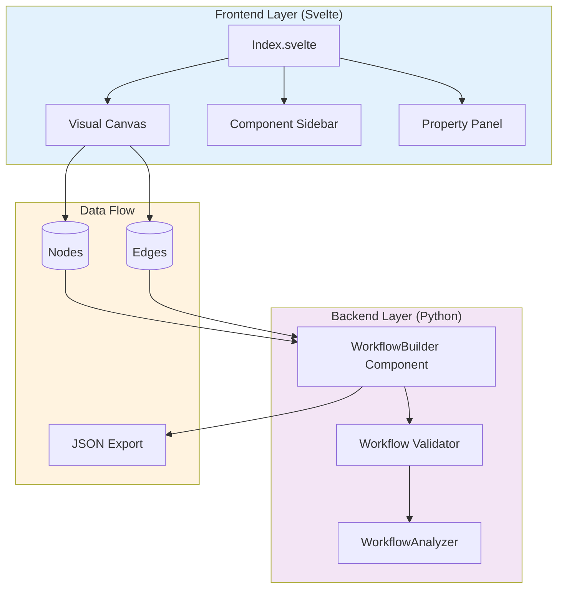
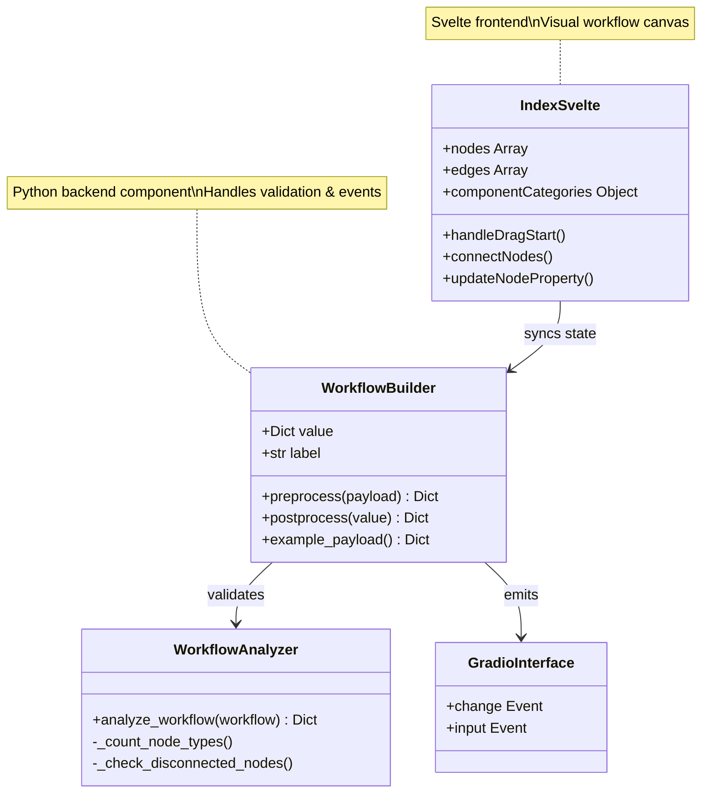
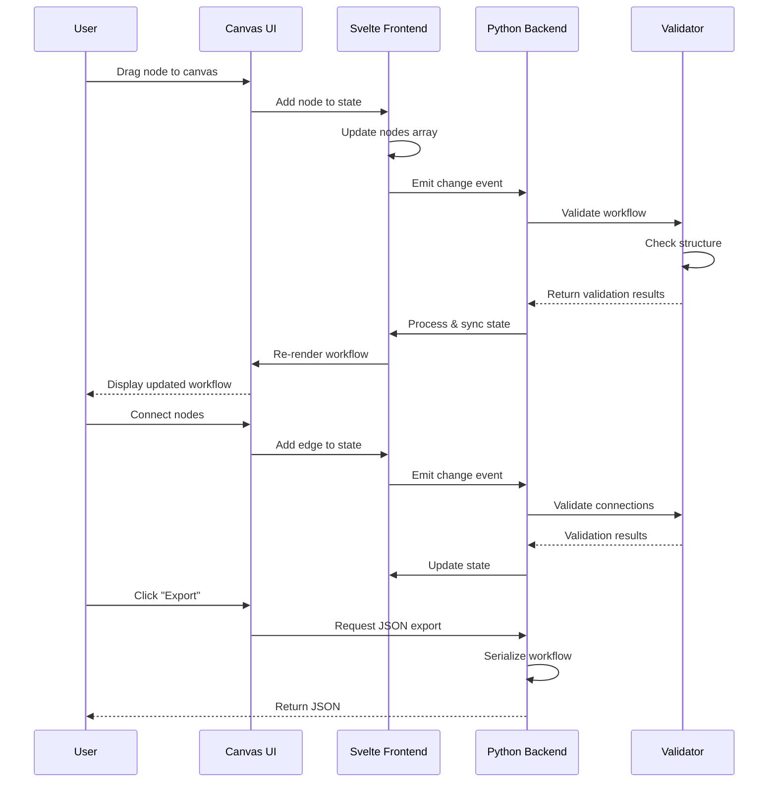

# Gradio WorkflowBuilder

[](https://pypi.org/project/gradio-workflowbuilder/)
[](LICENSE)
[](https://python.org)
[](https://pypi.org/project/gradio-workflowbuilder/)

> **Visual workflow builder custom component for Gradio, powered by SvelteFlow**

A professional drag-and-drop workflow builder component that integrates seamlessly with Gradio applications, enabling visual creation and editing of AI workflow diagrams with 25+ specialized node types.

## ✨ Features

- **🎨 Visual Workflow Design** - Drag-and-drop interface with real-time node connections
- **25+ Node Types** - Specialized nodes for inputs, AI models, data processing, tools, and outputs
- **🔄 Bidirectional Sync** - Seamless state management between Python backend and Svelte frontend
- **📤 JSON Export** - Export complete workflow configurations for persistence and reuse
- **🎯 Property Editing** - Edit node properties through collapsible side panels
- **🔍 Workflow Validation** - Built-in analyzer for detecting disconnected nodes and structural issues

## 🏗️ Architecture

### High-Level System Design



### Component Relationship Diagram



### Data Processing Flow



## 📦 Installation

**Quickstart (Tutorial)**

```bash
pip install gradio_workflowbuilder
```

**Development Mode (How-to)**

```bash
# Clone repository
git clone <repository-url>
cd gradio_workflowbuilder

# Install in editable mode
pip install -e .

# Install with development dependencies
pip install -e ".[dev]"
```

## 🚀 Quick Start

### Basic Usage (Tutorial)

```python
import gradio as gr
from gradio_workflowbuilder import WorkflowBuilder

# Create a simple workflow builder interface
with gr.Blocks() as demo:
    workflow_builder = WorkflowBuilder(
        label="🎨 Visual Workflow Designer",
        info="Drag components to build your workflow"
    )
    
demo.launch()
```

### Complete Example with Export (How-to)

```python
import gradio as gr
from gradio_workflowbuilder import WorkflowBuilder
import json

def export_workflow(workflow_data):
    """Export workflow as formatted JSON"""
    if not workflow_data:
        return "No workflow to export"
    return json.dumps(workflow_data, indent=2)

with gr.Blocks(title="Workflow Builder") as demo:
    workflow_builder = WorkflowBuilder(
        label="🎨 Visual Workflow Designer",
        info="Drag → Connect → Edit → Export"
    )
    
    with gr.Row():
        export_output = gr.Code(
            language="json",
            label="Workflow Configuration"
        )
    
    export_btn = gr.Button("💾 Export JSON")
    
    # Connect export button
    export_btn.click(
        fn=export_workflow,
        inputs=[workflow_builder],
        outputs=[export_output]
    )

demo.launch()
```

## 📖 Component Reference

### WorkflowBuilder Class (Reference)

#### Initialization Parameters

| Parameter | Type | Default | Description |
|-----------|------|---------|-------------|
| `value` | `Optional[Dict[str, Any]]` | `None` | Default workflow data with nodes and edges |
| `label` | `Optional[str]` | `None` | Component label |
| `info` | `Optional[str]` | `None` | Additional component information |
| `show_label` | `Optional[bool]` | `None` | Whether to show the label |
| `container` | `bool` | `True` | Whether to use container styling |
| `scale` | `Optional[int]` | `None` | Relative width scale |
| `min_width` | `int` | `160` | Minimum width in pixels |
| `visible` | `bool` | `True` | Whether component is visible |
| `elem_id` | `Optional[str]` | `None` | HTML element ID |
| `elem_classes` | `Optional[List[str]]` | `None` | CSS classes |
| `render` | `bool` | `True` | Whether to render immediately |

#### Events (Reference)

- **`change`** - Triggered when workflow value changes (user input OR function update)
- **`input`** - Triggered only on user input changes

### Workflow Data Format (Reference)

```python
{
    "workflow_id": "unique-id",
    "workflow_name": "My Workflow",
    "nodes": [
        {
            "id": "Node-1",
            "type": "Input",
            "position": {"x": 100, "y": 200},
            "data": {
                "display_name": "Input Node",
                "template": {
                    "field_name": {
                        "display_name": "Field Label",
                        "type": "string",
                        "value": "default value",
                        "is_handle": true
                    }
                }
            }
        }
    ],
    "edges": [
        {
            "id": "e1",
            "source": "Node-1",
            "source_handle": "output_field",
            "target": "Node-2",
            "target_handle": "input_field"
        }
    ]
}
```

## 🎯 Node Types (Reference)

The component includes 25+ specialized node types organized into categories:

### Input/Output Nodes
- **ChatInput** 💬 - User message input
- **ChatOutput** 💭 - AI response output
- **Input** 📥 - Generic data source (string, image, video, audio, file)
- **Output** 📤 - Generic data sink

### AI Model Nodes
- **OpenAI** - OpenAI API integration
- **Anthropic Claude** - Claude model integration
- **Ollama** - Local model serving
- **HuggingFace** - HF model inference

### Data Processing Nodes
- **ExecutePython** 🐍 - Execute Python code
- **ConditionalLogic** 🔀 - Branching logic
- **Wait** ⏳ - Delay execution

### Tools & Utilities
- **GoogleSearch** 🔍 - Web search integration
- **FileReader** 📁 - File I/O operations
- **JSONParser** - JSON manipulation

## 🛠️ Development (How-to)

### Project Structure (Explanation)

```
src/
├── backend/
│   └── gradio_workflowbuilder/
│       ├── workflowbuilder.py      # Main component class
│       └── templates/              # Built frontend (auto-generated)
├── frontend/
│   ├── Index.svelte               # Main workflow canvas UI
│   ├── Example.svelte             # Example component
│   └── package.json               # Frontend dependencies
├── demo/
│   ├── app.py                     # Demo application
│   └── space.py                   # Space launcher
├── pyproject.toml                 # Python package config
└── README.md                      # Documentation
```

### Building the Component (How-to)

**Python Package**

```bash
# Build distribution
python -m build

# Or using hatch
hatch build
```

**Frontend Assets**

```bash
cd frontend
npm install
# Gradio's build system handles compilation automatically
```

### Running the Demo (Tutorial)

```bash
python space.py
# Server available at http://localhost:7860
```

### Making Changes (How-to)

**Frontend Development**

1. Edit files in `frontend/` directory
2. Gradio automatically rebuilds to `backend/templates/`
3. Test changes by running `python space.py`
4. Component hot-reloads during development

**Backend Development**

1. Edit `backend/gradio_workflowbuilder/workflowbuilder.py`
2. Changes take effect immediately in development mode
3. Test with `python space.py`

## 🔧 Advanced Usage (How-to)

### Workflow Analysis (How-to)

```python
from gradio_workflowbuilder import WorkflowAnalyzer

# Analyze workflow structure
workflow_data = {
    "nodes": [...],
    "edges": [...]
}

analysis = WorkflowAnalyzer.analyze_workflow(workflow_data)

print(f"Complexity: {analysis['complexity']}")
print(f"Node types: {analysis['node_types']}")
print(f"Issues: {analysis['issues']}")
```

### Custom Node Properties (How-to)

Node templates support various field types:

```python
{
    "template": {
        "text_field": {
            "display_name": "Text Input",
            "type": "string",
            "value": "default"
        },
        "number_field": {
            "display_name": "Number Input",
            "type": "number",
            "value": 42,
            "min": 0,
            "max": 100
        },
        "choice_field": {
            "display_name": "Select Option",
            "type": "options",
            "options": ["opt1", "opt2"],
            "value": "opt1"
        },
        "connection_point": {
            "display_name": "Input",
            "type": "object",
            "is_handle": true
        }
    }
}
```

## 📋 Requirements (Reference)

### Python Dependencies

- **Python** ≥ 3.10
- **Gradio** ≥ 4.0, < 6.0

### Frontend Dependencies

- **Svelte** ^4.0.0
- **@xyflow/svelte** ^1.0.2
- **@gradio/atoms** 0.16.1
- **@gradio/utils** 0.10.2

### Build System

- **Hatchling** (build backend)
- **Node.js** (for frontend development)

## 🧪 Testing

⚠️ **No automated test suite currently exists.**

When adding tests:

```bash
# Python tests (future)
pytest backend/

# Frontend tests (future)
cd frontend && npm test
```

## 📝 Development Status (Explanation)

**Current Version:** 0.0.1 (Alpha)

**Development Stage:** Alpha - expect API changes

**Known Limitations:**
- No automated test coverage
- Author information needs updating for forks
- Component API may change in future releases

## 🤝 Contributing (How-to)

### Code Style

**Python**
- Python ≥ 3.10 required
- Type hints for function signatures
- Docstrings for classes and public methods
- Follow PEP 8 conventions

**Frontend**
- Svelte 4.x with TypeScript
- camelCase for variables/functions
- PascalCase for components
- Reactive declarations with `$:` syntax

### Git Workflow

**Branch Naming**
```
feature/<description>    # New features
fix/<issue>             # Bug fixes
docs/<topic>            # Documentation
refactor/<component>    # Code refactoring
```

**Commit Messages** (Conventional Commits)
```
feat(scope): Add new feature
fix(scope): Fix bug
docs: Update documentation
refactor: Restructure code
```

## 📄 License

This project is licensed under the **Apache License 2.0**

## 🔗 Resources

- [Gradio Custom Components Guide](https://www.gradio.app/guides/custom-components)
- [Svelte Documentation](https://svelte.dev/docs)
- [@xyflow/svelte Documentation](https://svelteflow.dev/)
- [Python Packaging](https://packaging.python.org/)

---

**Built with** 🐍 Python · 🎨 Svelte · ⚡ Gradio

**Powered by** [@xyflow/svelte](https://svelteflow.dev/) for visual workflow editing
```
